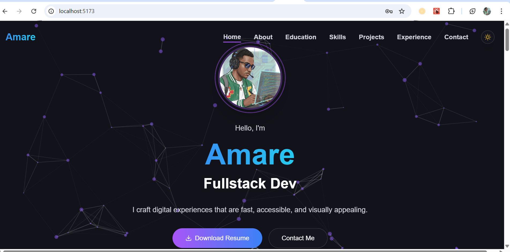
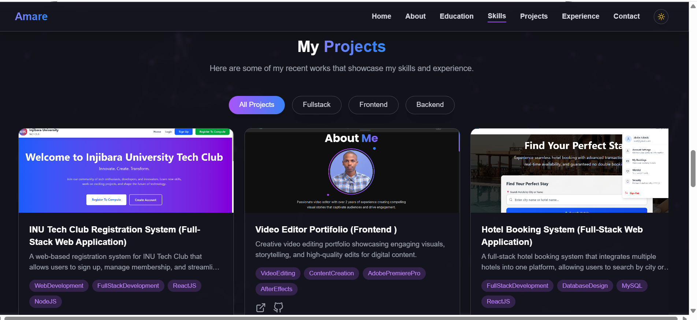
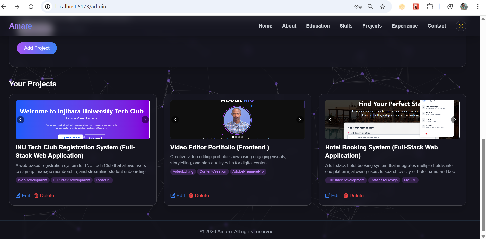

# 🚀 Full-Stack Developer Portfolio

A modern, responsive, and feature-rich portfolio website built with React, Node.js, Express, and MySQL. It includes a dynamic project showcase, an admin dashboard to manage projects, a contact form with email notifications, and a 3D particle background.

## 📸 Screenshots

| Homepage | Projects Section | Admin Dashboard |
|----------|----------------|------------------|
|  |  |  |

## ✨ Features

- **Fully responsive** – works on mobile, tablet, and desktop
- **Glassmorphism UI** with dark/light theme toggle
- **3D particle background** (tsParticles)
- **Dynamic projects** – fetch from MySQL database
- **Admin dashboard** – add, edit, delete projects and manage multiple images
- **Project carousel** on homepage with filters (Frontend, Fullstack, Backend)
- **Project detail page** with image slideshow
- **Contact form** – saves messages to database and sends email notifications (Nodemailer)
- **Resume download** button
- **Socials page** – all your links in one place
- **SEO-friendly** structure

## 🛠️ Tech Stack

### Frontend
- React 18
- Vite
- Tailwind CSS
- Framer Motion
- React Router DOM
- Axios
- React Icons
- tsParticles (3D background)
- React Intersection Observer

### Backend
- Node.js
- Express.js
- MySQL (with mysql2)
- JWT authentication
- Bcryptjs
- Nodemailer
- Multer (file uploads)
- Dotenv

## 📋 Prerequisites

- Node.js (v18 or later)
- MySQL (v8 or later)
- npm or yarn
- Git

## 🔧 Installation & Setup

### 1. Clone the repository

```bash
git clone https://github.com/ame12-max/FUTURE_FS_01.git
cd FUTURE_FS_01
2. Backend Setup
bash
cd Server
npm install
Create a .env file in the Server folder:

env
PORT=3000
DB_HOST=localhost
DB_USER=root
DB_PASSWORD=your_mysql_password
DB_NAME=portfolio_db
JWT_SECRET=your_super_secret_key
EMAIL_USER=your_email@gmail.com
EMAIL_PASS=your_app_password
Important: For Gmail, use an App Password – not your regular password.

3. Database Setup
Run MySQL and create the database and tables:

sql
CREATE DATABASE portfolio_db;
USE portfolio_db;

-- Projects table
CREATE TABLE projects (
  id INT AUTO_INCREMENT PRIMARY KEY,
  title VARCHAR(255) NOT NULL,
  description TEXT,
  full_description TEXT,
  image_url VARCHAR(500),
  live_url VARCHAR(500),
  github_url VARCHAR(500),
  technologies TEXT,
  features TEXT,
  category ENUM('frontend','fullstack','backend') DEFAULT 'fullstack',
  tags TEXT,
  created_at TIMESTAMP DEFAULT CURRENT_TIMESTAMP
);

-- Project images table
CREATE TABLE project_images (
  id INT AUTO_INCREMENT PRIMARY KEY,
  project_id INT NOT NULL,
  image_url VARCHAR(500) NOT NULL,
  title VARCHAR(255),
  display_order INT DEFAULT 0,
  FOREIGN KEY (project_id) REFERENCES projects(id) ON DELETE CASCADE
);

-- Contacts table
CREATE TABLE contacts (
  id INT AUTO_INCREMENT PRIMARY KEY,
  name VARCHAR(255) NOT NULL,
  email VARCHAR(255) NOT NULL,
  subject VARCHAR(255),
  message TEXT NOT NULL,
  created_at TIMESTAMP DEFAULT CURRENT_TIMESTAMP
);

-- Admin users table
CREATE TABLE admins (
  id INT AUTO_INCREMENT PRIMARY KEY,
  username VARCHAR(100) UNIQUE NOT NULL,
  password VARCHAR(255) NOT NULL
);

-- Insert default admin (password: admin123)
INSERT INTO admins (username, password) VALUES ('admin', '$2b$10$YourHashedPassword');
To generate the hashed password, run this Node.js command once:

js
const bcrypt = require('bcryptjs');
console.log(bcrypt.hashSync('admin123', 10));
4. Frontend Setup
From the project root:

bash
npm install
Create a .env file in the root folder:

env
VITE_API_BASE_URL=http://localhost:3000
5. Run the Application
Start the backend (from Server folder):

bash
node server.js
# or with nodemon: npm run dev
Start the frontend (from project root):

bash
npm run dev
Open http://localhost:5173 to view the portfolio.

🔐 Admin Dashboard
Access at: http://localhost:5173/admin/login

Default credentials:
Username: admin
Password: admin123

Once logged in, you can:

Add new projects with title, description, technologies, features, tags, and multiple images

Edit or delete existing projects

All changes are immediately reflected on the live site

📁 Folder Structure
text
FUTURE_FS_01/
├── Server/                 # Backend
│   ├── config/             # Database connection
│   ├── controllers/        # Business logic
│   ├── middleware/         # Auth middleware
│   ├── routes/             # API routes
│   ├── uploads/            # Uploaded project images
│   ├── .env
│   └── server.js
├── src/                    # Frontend
│   ├── assets/             # Images, resume PDF
│   ├── components/         # Reusable UI components
│   ├── context/            # Theme context
│   ├── hooks/              # Custom hooks (typewriter)
│   ├── pages/              # Home, Socials, ProjectDetail, Admin
│   ├── App.jsx
│   ├── main.jsx
│   └── index.css
├── .env
├── package.json
└── README.md
🚀 Deployment
Backend (e.g., Render, Railway, or Vercel + serverless)
Set environment variables in your hosting platform.

Use a MySQL cloud database (e.g., ClearDB, Aiven, or PlanetScale).

Update VITE_API_BASE_URL to point to your live backend URL.

Frontend (Vercel, Netlify)
Build the project: npm run build

Deploy the dist folder.

Ensure VITE_API_BASE_URL is set to your live backend URL.

📸 Screenshots
Homepage	Projects Section	Admin Dashboard
https://./homepage.png	https://./projects.png	https://./admin-dashboard.png
Make sure the screenshot files exist in the project root with the names above, or adjust the paths accordingly.

📄 License
This project is for educational purposes as part of the Future Interns Full Stack Web Development internship.

👨‍💻 Author
Amare – GitHub | LinkedIn

🙏 Acknowledgements
Future Interns for the internship opportunity

React, Tailwind CSS, Framer Motion

tsParticles for the 3D background

Nodemailer for email notifications